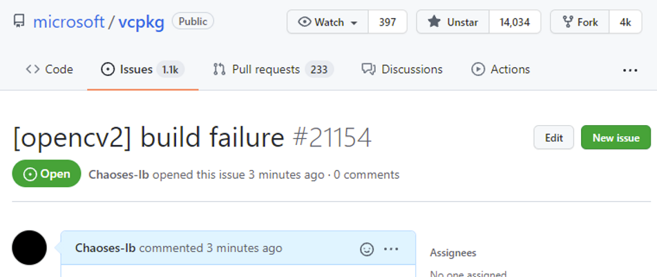

# vcpkg
[microsoft/vcpkg: C++ Library Manager for Windows, Linux, and MacOS](https://github.com/microsoft/vcpkg)

我终于也用上了 vcpkg，从此引用库只需要一行命令行，一行#include。



## Installation
- Scoop: `scoop install vcpkg`

`sudo vcpkg integrate install`

### 英文语言包
必须要 VS 安装英文语言包，否则无法安装库。

## Classic mode
- 安装 package 时**不会**自动更新依赖，可能因此导致编译失败。

### 库版本问题
[How to specify a version of a library - Issue #1681 - microsoft/vcpkg](https://github.com/microsoft/vcpkg/issues/1681)
1. git checkout <sha> -- prots/boost
2. [Vcpkg 2020.04 Update and Product Roadmap - C++ Team Blog](https://devblogs.microsoft.com/cppblog/vcpkg-2020-04-update-and-product-roadmap/)
3. [vcpkg/versioning.md at master - microsoft/vcpkg](https://github.com/microsoft/vcpkg/blob/master/docs/users/versioning.md)

## Manifest mode
[Manifest mode | Microsoft Learn](https://learn.microsoft.com/en-us/vcpkg/concepts/manifest-mode)

[vcpkg.json Reference | Microsoft Learn](https://learn.microsoft.com/en-us/vcpkg/reference/vcpkg-json)
```json
{
  "$schema": "https://raw.githubusercontent.com/microsoft/vcpkg-tool/main/docs/vcpkg.schema.json",
  "dependencies": [
    "boost-system",
    {
      "name": "cpprestsdk",
      "default-features": false
    },
    "libxml2",
    "yajl"
  ]
}
```

## CLI
- Auto-completion

  `./vcpkg integrate powershell`

## CMake
```cmd
cmake .. -DCMAKE_TOOLCHAIN_FILE="C:\L\C++\vcpkg\scripts\buildsystems\vcpkg.cmake" -DVCPKG_TARGET_TRIPLET=x64-windows-static-md
```

对于有 CMake 支持的包，可以直接 find_package：
```cmake
find_package(RapidJSON CONFIG REQUIRED)
target_link_libraries(main PRIVATE rapidjson)
```
对于没有 CMake 支持的包，需要手动 find_path 和 find_library：
```cmake
find_path(DETOURS_INCLUDE_DIR detours/detours.h)
find_library(DETOURS_LIBRARY detours)

target_include_directories(main
    PRIVATE ${DETOURS_INCLUDE_DIR}
    )
target_link_libraries(main
    PRIVATE ${DETOURS_LIBRARY}
    )
```

## triplet 问题
```cmd
vcpkg install zlib:x64-windows
vcpkg install zlib --triplet x64-windows
```
[c++ - How to use vcpkg installed packages in Visual Studio in reality? - Stack Overflow](https://stackoverflow.com/questions/59865669/how-to-use-vcpkg-installed-packages-in-visual-studio-in-reality)

[Install x64 packages as default instead of x86 - Issue #1254 - microsoft/vcpkg](https://github.com/microsoft/vcpkg/issues/1254)

[Multiple values for --triplet and %VCPKG\_DEFAULT\_TRIPLET% - Issue #7432 - microsoft/vcpkg](https://github.com/microsoft/vcpkg/issues/7432)


[Triplet files - vcpkg](https://vcpkg.readthedocs.io/en/latest/users/triplets/)

[Integration - vcpkg](https://vcpkg.readthedocs.io/en/latest/users/integration/#triplet-selection)

项目右键，左侧列表就有 vcpkg

### Static CRT 问题
内建的 x64-windows-static 会使用静态 CRT，很不舒服。

使用 x64-windows-static-md 和 x86-windows-static-md 代替。

[Does vcpkg build \`-static\` triplet with static CRT? - Issue #4274 - microsoft/vcpkg](https://github.com/microsoft/vcpkg/issues/4274)

## proxy 问题
```cmd
set HTTP_PROXY=socks5://localhost:10807/
set HTTPS_PROXY=socks5://localhost:10807/
```
[HTTPS proxy error - Issue #702 - microsoft/vcpkg](https://github.com/microsoft/vcpkg/issues/702)

[Error: Building package boost-compatibility:x86-windows failed with: BUILD\_FAILED - Issue #11627 - microsoft/vcpkg](https://github.com/microsoft/vcpkg/issues/11627)

4月20日合并了自动使用系统代理。

"\-- Automatically setting HTTP(S)\_PROXY environment variables to 127.0.0.1:1080"

[Use "IE Proxy Settings" correctly on Windows in vcpkg. by cnSchwarzer - Pull Request #49 - microsoft/vcpkg-tool](https://github.com/microsoft/vcpkg-tool/pull/49)

[If HTTP(S)\_PROXY already exist in environment variable, do not use IE Proxy (#49) by cnSchwarzer - Pull Request #77 - microsoft/vcpkg-tool](https://github.com/microsoft/vcpkg-tool/pull/77)

## 提交库
[Frequently Asked Questions - vcpkg](https://vcpkg.readthedocs.io/en/latest/about/faq/#how-do-i-get-more-libraries)

重名问题：[\[sciplot\] Add new port by CaeruleusAqua - Pull Request #15913 - microsoft/vcpkg](https://github.com/microsoft/vcpkg/pull/15913)

## Version updating
[Adding a new version](https://learn.microsoft.com/en-us/vcpkg/maintainers/registries#adding-a-new-version)
- [What is the most convenient way to find out SHA512 in `vcpkg_from_github`? - Issue #14968 - microsoft/vcpkg](https://github.com/microsoft/vcpkg/issues/14968)

  Temporarily set SHA512 to 0, `vcpkg install`, get the SHA512 from the error message.

- `./vcpkg x-add-version --all`

## boost
~~[Error: Building package boost-exception:x64-windows failed with: BUILD\_FAILED - Issue #6330 - microsoft/vcpkg](https://github.com/microsoft/vcpkg/issues/6330)~~

原因是 boost 依赖的某个构建工具不支持中文用户名。

[→中文用户名问题]()

> [Error: Building package boost-regex:x64-windows failed with: BUILD\_FAILED - Issue #9945 - microsoft/vcpkg](https://github.com/microsoft/vcpkg/issues/9945)

## 批量移除问题
[Remove multiple packages at once (wildcards) - Issue #2793 - microsoft/vcpkg](https://github.com/microsoft/vcpkg/issues/2793)

[Removing packages using a pattern or regular expression - Issue #8486 - microsoft/vcpkg](https://github.com/microsoft/vcpkg/issues/8486)

## VSC
```json
"/MD",
"/I",
"C:/L/C++/vcpkg/installed/x64-windows-static-md/include",
"/link",
"/LIBPATH:C:/L/C++/vcpkg/installed/x64-windows-static-md/lib"
```
[Integrate vcpkg with Visual Studio or Visual Studio Code | Microsoft Docs](https://docs.microsoft.com/en-us/cpp/build/integrate-vcpkg?view=msvc-160)

[VS Code doesn't recognize Vcpkg include path - Issue #4002 - microsoft/vscode-cpptools](https://github.com/microsoft/vscode-cpptools/issues/4002)

## 更新问题
pull 不会更新 exe，要运行下 bootstrap-vcpkg.bat。

## 清理
```
boost ...
detours:x64-windows-static-md                      4.0.1#2          Detours is a software package for monitoring and...
detours:x86-windows-static-md                      4.0.1#2          Detours is a software package for monitoring and...
fmt:x64-windows-static-md                          7.1.3#5          Formatting library for C++. It can be used as a ...
imgui:x64-windows-static-md                        1.83             Bloat-free Immediate Mode Graphical User interfa...
imgui[dx11-binding]:x64-windows-static-md                           Make available DirectX11 binding
imgui[win32-binding]:x64-windows-static-md                          Make available Win32 binding
msmpi:x64-windows-static-md                        10.1.12498#1     Microsoft MPI (MS-MPI) is a Microsoft implementa...
rapidjson:x64-windows-static-md                    2020-09-14#1     A fast JSON parser/generator for C++ with both S...
vcpkg-cmake-config:x64-windows                     2021-05-22
vcpkg-cmake:x64-windows                            2021-06-25#4
yaml-cpp:x64-windows-static-md                     0.6.3#1          yaml-cpp is a YAML parser and emitter in C++ mat...
```
buildtrees 似乎是 installed 和 packageds 的链接源，不能乱删。

[Automatic clean up of old files? - Issue #2874 - microsoft/vcpkg](https://github.com/Microsoft/vcpkg/issues/2874)

## Linux
```sh
git clone https://github.com/microsoft/vcpkg
./vcpkg/bootstrap-vcpkg.sh
```
x64 下默认 triplet 是 x64-linux（static）


[vcpkg/overlay-triplets-linux-dynamic.md at master - microsoft/vcpkg](https://github.com/microsoft/vcpkg/blob/master/docs/examples/overlay-triplets-linux-dynamic.md)

dynamic 需要用 overlay-triplets，但是不一定能编译成功