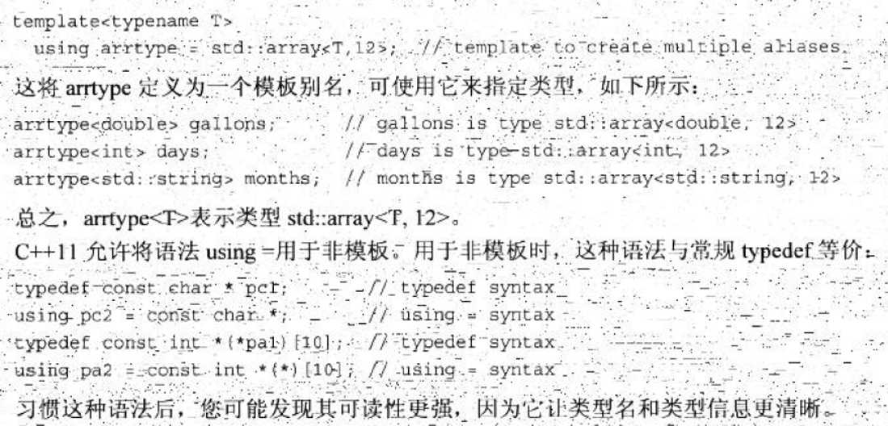

# Aliases
别名封装是指比函数、类这种“从更大的结构中总结出小的结构”更小的，“让小的结构更加小”的封装行为。

|  | 适用对象 |  | 
| --- | --- | --- | 
| 常量变量 | 字面量 |  | 
| 指针 | 函数、变量 |  | 
| 引用 | 函数、变量 |  | 
| 结构化绑定 | 结构 |  | 
| `using` | 类型、命名空间 |  | 
| `typedef` | 类型 | 与 `using` 相比不能用于模板 | 
| [lambda](Functions/Lambda.md) | 代码块 | 比函数更小一级 | 
| 宏 | all |  | 

[The joys and perils of C and C++ aliasing, Part 1 | Red Hat Developer](https://developers.redhat.com/blog/2020/06/02/the-joys-and-perils-of-c-and-c-aliasing-part-1)
- [The joys and perils of aliasing in C and C++, Part 2 | Red Hat Developer](https://developers.redhat.com/blog/2020/06/03/the-joys-and-perils-of-aliasing-in-c-and-c-part-2)

## 模板别名
