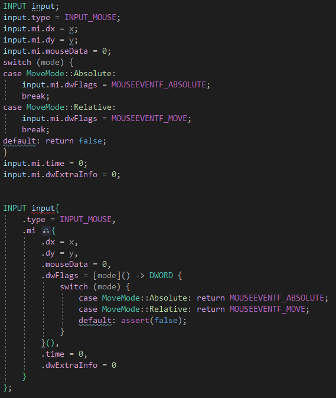

# Aggregate Initialization
## 指定初始化
C++20 支持，C99 支持

VC++ 不支持，clang、GCC 通过扩展可以支持

[C++ 的指定初始化器 - CoderZh Blog](https://blog.coderzh.com/2019/02/24/cpp-designated-initializers/)

[C++ 结构体初始化与赋值\_Dablelv的博客专栏-CSDN博客\_结构体初始化](https://blog.csdn.net/K346K346/article/details/51537077)


[Aggregate initialization - cppreference.com](https://en.cppreference.com/w/cpp/language/aggregate_initialization)

## Designated initializers (C++20)
```cpp
struct A{
  int x;
  int y;
  int z;
};
A a{
  .x = 1,
  .z = 2
};
```
- 指派顺序必须与声明顺序一致
- 不能混合使用指派初始化和非指派初始化

  
神清气爽。