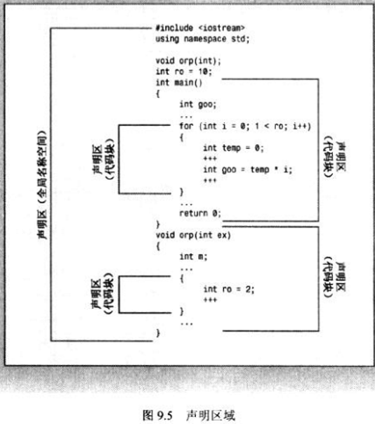

# [Scopes](https://en.cppreference.com/w/cpp/language/scope)
声明区域：“可以在其中进行声明的区域”
- 如对于函数外声明的全局变量，它的声明区域就是所在文件；

  对于函数内声明的变量，它的声明区域是所在代码块
- 有三种声明区域：
  - 文件
  - 代码块
  - 命名空间

潜在作用域：变量的潜在作用域从声明点开始，直至声明区域的结尾
- 声明区域 > 潜在作用域 ≥ 作用域
- 在潜在作用域中，名称也并非总是可用的，它可能被嵌套声明区域中的同名变量隐藏

作用域：变量对程序可见的范围

| | |
| --- | --- |
|  | 