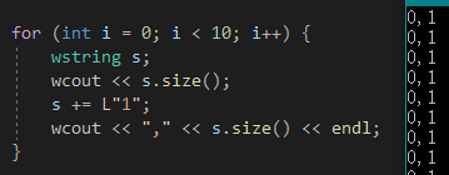
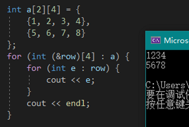

# Loops
## [`for` loop](https://en.cppreference.com/w/cpp/language/for)
`for(init; test; update) …;` 可以改写为：
```cpp
{
init;
while (test)
{
    …;
    update;
}
}
```

### `for` 如何定义多个不同类型的变量？
`for` 可以一次定义多个同类型变量，但不能定义多个不同类型的（因为那又需要一个分号）

解决方法：
- 定义在 `for` 之前

  但只在循环里面用到的变量却定义在循环外，有些不干净

- 定义在代码块内
  - 只适合于 test 和 update 用不到的变量
  - 不适合声明非基本类型，因为变量会被不停分配、释放，浪费性能：

    

- 借助匿名结构

  ```cpp
  wstring s = L"abcde";
  for (struct {
      int i;
      wchar_t c;
      } t {0, s[0]}; t.i < s.size(); t.c = s[++t.i])
  {
      wcout << t.i << t.c;
  }
  ```
  ```cpp
  wstring s = L"abcde";
  for (struct {
      int i;
      wchar_t c;
      } t {0, s[0]}; t.i < s.size(); t.c = s[++t.i])
  {
      int &i = t.i; wchar_t &c = t.c;
      
      wcout << i << c;
  }
  ```
  过于繁琐

## [Range-based for loop](https://en.cppreference.com/w/cpp/language/range-for)
```cpp
for (int a : array)
    cout << a << endl;
```
- 需要修改数组元素时则需使用 `&a`
- 缺少 `&` 时，对元素的修改不会影响元素本身，每次循环都会复制、析构元素，可能导致 bug
- 可以用于字面量数组：`for (int a : {1, 2, 3})`

### 二维数组问题


（可以用 auto）

[范围 for 语句与二维数组_geekwang的专栏-CSDN博客_基于范围的for循环 二维数组](https://blog.csdn.net/gcvdsvb/article/details/26461495)

[C++Primer_范围for处理多维数组_有头脑的timChaoH的博客-CSDN博客_for (auto& item : row)](https://blog.csdn.net/timChaosH/article/details/66478161?utm_medium=distribute.pc_relevant.none-task-blog-BlogCommendFromMachineLearnPai2-1.channel_param&depth_1-utm_source=distribute.pc_relevant.none-task-blog-BlogCommendFromMachineLearnPai2-1.channel_param)