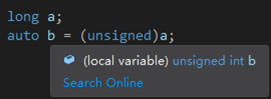

# [Conversions](https://en.cppreference.com/w/cpp/language/expressions#Conversions)
## Standard conversions
- 浮点数转换为整数时，C++ 采用截断（丢弃小数部分）而不是四舍五入。

- 整型提升

  在计算表达式时，C++ 会将小于 `int` 的类型提升为 `int`（然后在赋值时可能再转为更小的类型）

  `wchar_t` 也会被提升（为 `int`/`uint`/`long`/`ulong`）

- 列表初始化不允许类型转换缩窄类型，所以浮点数不能转化为整数，大整数不能转化为小整数

## [Explicit conversions](https://en.cppreference.com/w/cpp/language/explicit_cast)
- `(int)num`

  C语言

- `int(num)`

  C++

  C确实不支持

类型转换运算符：
|     |     | 
| --- | --- | 
| `static_cast<int>(num)` | 向上/向下转换 | 
| `const_cast` | `const` 或 `volatile` | 
| `dynamic_cast` | 类的向上转换 | 
| `reinterpret_cast` | 强制转换（不允许缩窄；函数指针与数据指针不能互转） | 

### `(unsigned)`

`(unsigned)` 并不是只改变有无符号，而是 `(unsigned int)` 的简写