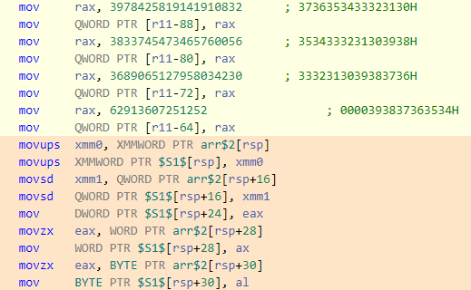
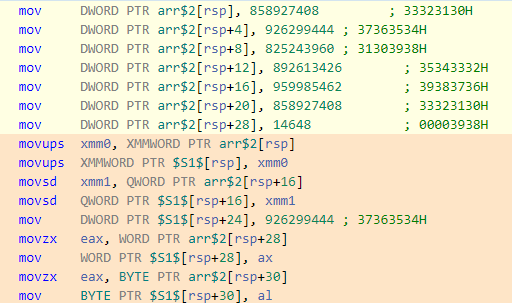
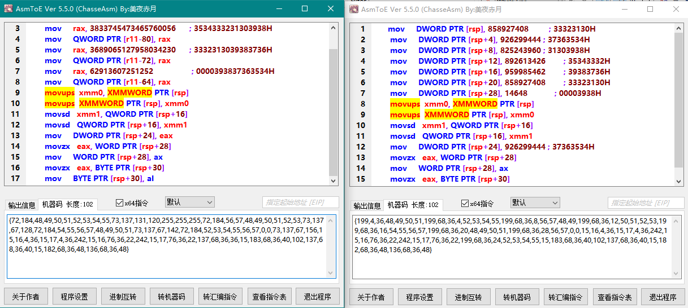
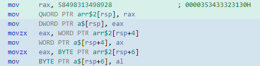
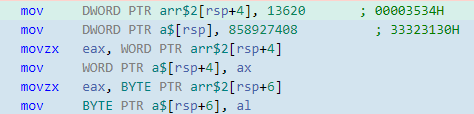

# Inline Strings
- [字面量](#字面量)
- [char 数组](#char-数组)
- [CHARARRAY](#chararray)
  - [Pure template version](#pure-template-version)
- [DEF_CHARARRAY](#def_chararray)
- [CHARARRAY_8](#chararray_8)
- [pyj2323/StrCrypt](Obfuscation/README.md)

[string - C++: Can a macro expand "abc" into 'a', 'b', 'c'? - Stack Overflow](https://stackoverflow.com/questions/4583022/c-can-a-macro-expand-abc-into-a-b-c)

我的操作的确模拟了字符数组，但字符数组并不能解决问题，这种方法只适用于短文本  
还要限定 MSVC，因为别的编译器对短文本本来就是立即数写入  
也就是说，我花的这几个小时，不过是在绕 MSVC 的一个 bug

除非禁用优化  
禁用优化之后，msvc 和 gcc 都可以保证立即数写入，gcc 可以直接用字面量，msvc 则需要借助字符数组  
但禁用优化最细只能控制到函数级，这种方法并不普适

## 字面量
### 短字符串
```cpp
int main(){
    char a[] = "abcde";
    cout << a << endl;
}
```
- clang x64 v11.0.1 | -std=c++17 -Ofast

  立即数写入

- gcc x64 v10.2 | -std=c++17 -Ofast

  立即数写入

- icc x64 v21.1.9 | -std=c++17 -Ofast

  立即数写入

- msvc x64 v19.28 | ~~-std=c++17~~ /O2

  字符串拷贝，草

### 中字符串
```cpp
int main(){
    char a[] = "abcdeabcdeabcdeabcdeabcdeabcde";
    cout << a << endl;
}
```
- icc x64 v21.1.9 | -std=c++17 -Ofast

  立即数写入

- gcc x64 v10.2 | -std=c++17 -Ofast

  立即数写入+字符串拷贝

- clang x64 v11.0.1 | -std=c++17 -Ofast

  字符串拷贝

- msvc x64 v19.28 | ~~-std=c++17~~ /O2

  字符串拷贝

### 长字符串
```cpp
int main(){
    char a[] = "abcdeabcdeabcdeabcdeabcdeabcdeabcdeabcdeabcdeabcdeabcdeabcdeabcdeabcdeabcdeabcdeabcdeabcdeabcdeabcdeabcdeabcdeabcdeabcde";
    cout << a << endl;
}
```
- icc x64 v21.1.9 | -std=c++17 -Ofast

  字符串拷贝

- gcc x64 v10.2 | -std=c++17 -Ofast

  立即数写入+字符串拷贝

<br />

- gcc x64 v10.2 | -std=c++17

  立即数写入（imm64）

- msvc x64 v19.28 | /std:C++17

  字符串拷贝（rep movsb）

- icc x64 v21.1.9 | -std=c++17

  字符串拷贝（rep movsd）

- clang x64 v11.0.1 | -std=c++17

  字符串拷贝（memcpy）

## char 数组
### 长字符串
```cpp
int main(){
    char a[]{'a','b','c','d','e','a','b','c','d','e','a','b','c','d','e','a','b','c','d','e','a','b','c','d','e','a','b','c','d','e','a','b','c','d','e','a','b','c','d','e','a','b','c','d','e','a','b','c','d','e','a','b','c','d','e','a','b','c','d','e','a','b','c','d','e','a','b','c','d','e','a','b','c','d','e','a','b','c','d','e','a','b','c','d','e','a','b','c','d','e','a','b','c','d','e','a','b','c','d','e','a','b','c','d','e','a','b','c','d','e','a','b','c','d','e','a','b','c','d','e'};
    cout << a << endl;
}
```
- msvc x64 v19.28 | ~~-std=c++17~~ /O2

  立即数写入+字符串拷贝

- gcc x64 v10.2 | -std=c++17 -Ofast

  立即数写入+字符串拷贝

- icc x64 v21.1.9 | -std=c++17 -Ofast

  字符串拷贝

- clang x64 v11.0.1 | -std=c++17 -Ofast

  字符串拷贝

<br />

- gcc x64 v10.2 | -std=c++17

  立即数写入（imm64）

- msvc x64 v19.28 | /std:C++17

  立即数写入（imm8）

- icc x64 v21.1.9 | -std=c++17

  字符串拷贝（rep movsd）

- clang x64 v11.0.1 | -std=c++17

  字符串拷贝（memcpy）

## CHARARRAY
```cpp
#include <utility>
#include <array>
#include <iostream>

using namespace std;

template <typename Str, std::size_t... Is>
__forceinline constexpr auto CHARARRAY_make_array(std::index_sequence<Is...>) {
    using TChar = std::remove_const_t< std::remove_reference_t< decltype(Str::str()[0]) > >;
    return std::array<TChar, sizeof...(Is)>{ Str::str()[Is]... };
}

#define CHARARRAY(STRING)                                  \
    []{                                                    \
        struct Str {                                       \
            static constexpr decltype(auto) str() {        \
                return STRING;                             \
            }                                              \
        };                                                 \
        return CHARARRAY_make_array<Str>( std::make_index_sequence<std::size(Str::str())>() );  \
    }()

int main(){
    auto a = CHARARRAY("abcde");
    cout << a.data() << endl;
}
```

### 短字符串
- gcc x64 v10.2 | -std=c++17 -Ofast

  完美

- msvc x64 v19.28 | ~~-std=c++17~~ /O2

  return array 会在栈上构造一个数组，然后拷贝到 a

- icc x64 v21.1.9 | -std=c++17 -Ofast

  在函数尾放置字符串，拷贝到 a

- clang x64 v11.0.1 | -std=c++17 -Ofast

  普通字符串拷贝

### 长字符串
- msvc x64 v19.28 | ~~-std=c++17~~ /O2

  立即数写入+字符串拷贝

- gcc x64 v10.2 | -std=c++17 -Ofast

  立即数写入+字符串拷贝

- icc x64 v21.1.9 | -std=c++17 -Ofast

  字符串拷贝

- clang x64 v11.0.1 | -std=c++17 -Ofast

  字符串拷贝

临界是 "01234567890123"，15个字符，超过了 4\*3+2

使用 `return std::array<TChar, sizeof...(Is)+1>{ Str::str()[Is]..., '\0' };` 可以改善长文本的复制指令

### Pure template version
```cpp
#include <utility>
#include <array>
#include <iostream>

using namespace std;

template <class _Ty, std::size_t N, std::size_t ... Is>
__forceinline constexpr std::array<_Ty, N> to_array(const _Ty(&a)[N], std::index_sequence<Is...>)
{
    return { {a[Is]...} };
}

template <class _Ty, std::size_t N>
__forceinline constexpr std::array<_Ty, N> CHARARRAY(const _Ty(&a)[N])
{
    return to_array(a, std::make_index_sequence<N>());
}

int main(){
    auto a = CHARARRAY("01234567890123");
    cout << a.data() << endl;
}
```
临界是 14 个字符

## DEF_CHARARRAY
```cpp
#include <utility>
#include <array>
#include <iostream>

using namespace std;

template <typename Str, std::size_t... Is, typename TChar = std::remove_const_t< std::remove_reference_t< decltype(Str::str()[0]) >> >
__forceinline void CHARARRAY_write(TChar* dest, std::index_sequence<Is...>) {
    for (TChar c : { Str::str()[Is]... })
        *dest++ = c;
}

#define DEF_CHARARRAY(NAME, STRING) \
    std::remove_const_t<std::remove_reference_t<decltype(STRING[0])>> NAME[std::size(STRING)];  \
    [&NAME]{                                                    \
        struct Str {                                       \
            static constexpr decltype(auto) str() {        \
                return STRING;                             \
            }                                              \
        };                                                 \
        CHARARRAY_write<Str>(NAME, std::make_index_sequence<std::size(STRING)>());    \
    }()

int main(){
    DEF_CHARARRAY(a, "abcde");
    cout << a << endl;
}
```
- icc x64 v21.1.9 | -std=c++17 -Ofast

  立即数写入

- msvc x64 v19.28 | ~~-std=c++17~~ /O2

  立即数写入临时数组，迭代器循环拷贝

  - 不使用迭代器
    ```cpp
    __forceinline void CHARARRAY_write(TChar* dest, std::index_sequence<Is...>) {
        TChar t[] = { Str::str()[Is]... };
        for (int i=0; i < sizeof...(Is); i++)
            *dest++ = t[i];
    }
    ```
    立即数写入临时数组，N指令计数拷贝

- clang x64 v11.0.1 | -std=c++17 -Ofast

  立即数写入，会调用 `strlen`

- gcc x64 v10.2 | -std=c++17 -Ofast

  普通字符串拷贝，会调用 `strlen`

临界是 "012345678901234"，16个字符

## CHARARRAY_8
```cpp
#include <utility>
#include <array>
#include <iostream>

using namespace std;

template <typename Str, std::size_t... Is>
__forceinline constexpr auto CHARARRAY_make_array(std::index_sequence<Is...>) {
    using TChar = std::remove_const_t< std::remove_reference_t< decltype(Str::str()[0]) > >;
    union {
        std::array<uint64_t, sizeof...(Is)> i;
        std::array<TChar, std::size(Str::str()) - 7> s;
    } arr{ ((uint64_t*)Str::str())[Is]... };
    return arr.s;
}

#define CHARARRAY(STRING)                                  \
    []{                                                    \
        struct Str {                                       \
            static constexpr decltype(auto) str() {        \
                return (STRING"\0\0\0\0\0\0\0");           \
            }                                              \
        };                                                 \
        return CHARARRAY_make_array<Str>( std::make_index_sequence<std::size(Str::str()) / 8>() );  \
    }()

[[msvc::flatten]]
int main() {
    auto a = CHARARRAY("012345678901234567890123456789");
    cout << a.data() << endl;
}
```
`/std:c++17 /O2`

### "012345678901234567890123456789"
`uint64_t` | `uint32_t`
--- | ---
 <br /> 长度 102 |  <br />  <br /> 长度，也是 102……

### "012345"
`uint64_t` | `uint32_t`
--- | ---
 <br /> 长度 36 |  长度 34

文本过长时强制内联会失效，变成函数。

但是即使开了 `/O2` 和 `flatten` 也会生成几个多余的 lambda，里面会引用静态内存存的原始文本，明明都没调用到。不过链接时可能会优化掉。